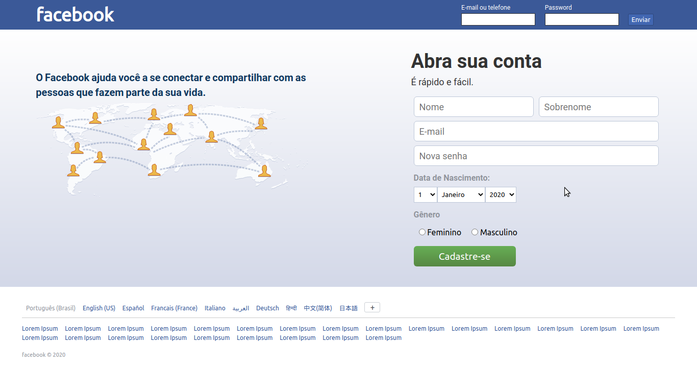

# Clone Interface Facebook

Neste segundo projeto prático do curso Webmaster Front-end da **Danki** **Code**,
fizemos o clone da interface da primeira página do **Facebook**.

Foram usadas as tecnologias:
- HTML
- CSS

IDE utilizada:
- Visual Studio Code